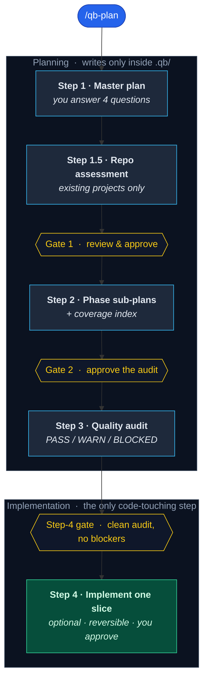

<div align="center">

# QB

**Plan any project end to end — without leaving Claude Code.**

Turn a fuzzy idea into a clear, reviewed, build-ready plan,
then ship it one safe slice at a time.

<br>

[](CHANGELOG.md)
[](LICENSE)
[](https://claude.com/claude-code)
[](#what-youll-get)

[Quick start](#quick-start) ·
[How it works](#how-it-works) ·
[Commands](#commands) ·
[Safety](#you-stay-in-control) ·
[FAQ](#faq)

</div>

---

QB is a **Claude Code plugin** that runs a guided, multi-step planning workflow right in your chat. You answer a few short questions in your own language, and QB:

1. **Inspects** your repository,
2. writes a senior-architect **master plan**,
3. breaks it into detailed **phase sub-plans**,
4. **audits** them for quality and coverage,
5. and — only if you approve — **implements** one reviewed slice.

It pauses for your explicit approval at every step. No CLI, no API key, no setup. Just type `/qb-plan`.

> QB is one of three platform packages in the QB monorepo (Claude Code / Cursor / Codex), an independent project inspired by — not a direct port of — **CursorQB** and **CodexQB** by **Alican Kiraz**.

---

## Why QB?

| | |
|---|---|
| **From idea to plan, fast** | No more blank page — get a structured, phase-by-phase plan grounded in your real repository. |
| **Repo-aware** | It reads your codebase first and proposes evidence-backed answers, so the plan fits what you already have. |
| **Quality-checked** | A built-in auditor plus a read-only validator catch missing sections, gaps, and scope drift before you build. |
| **You stay in control** | An explicit approval gate sits between every step, and planning never touches your source code. |
| **Speaks your language** | Questions are asked in whatever language you write in; the planning documents are written in English. |

---

## Quick start

**1. Install** — add the marketplace from GitHub, then install it:

```text
/plugin marketplace add eserlxl/qb
/plugin install qb@eserlxl
```

To install from a local checkout instead, point `/plugin marketplace add` at this package's `platforms/claude-code` directory (or, for a standalone package checkout, at that package root).

**2. Plan** — open Claude Code in your project and run:

```text
/qb-plan
```

Then answer the four short questions and approve each step as you go. That's it.

> See [`docs/INSTALLATION.md`](docs/INSTALLATION.md) for marketplace details and verification steps.

---

## How it works



| Step | Name | What happens | Output | Your part |
|:--:|---|---|---|---|
| **1** | Master plan | Repo-aware intake, then a senior-architect plan. | `.qb/main-planning.md` | Answer 4 questions |
| **1.5** | Assessment | For existing projects, a technical health report. | `.qb/assessment.md` | — (auto / skipped) |
| **Gate 1** | Review | Review the plan (and assessment) together. | — | Feedback + approve |
| **2** | Sub-plans | Every phase becomes detailed sub-plans plus an index. | `.qb/phase-<n>-plans/` + `sub-planning-index.md` | — |
| **Gate 2** | Approve audit | Confirm you want the quality audit. | — | Approve |
| **3** | Audit | Coverage/quality audit with a `PASS` / `PASS_WITH_WARNINGS` / `BLOCKED` status. | `.qb/sub-planning-audit.md` | Approve repairs if needed |
| **4** | Implement | One bounded, reversible code slice from a `READY` sub-plan. | code changes (gated) | Approve (gated) |

---

## How the long steps run

QB stays fully in-session. The `qb-planner` orchestrator runs the interactive Step 1 intake itself, then **delegates** each long, autonomous step to a matching subagent via the **Task tool**, handing it that step's goal contract (objective / success evidence / scope bounds / stop condition) plus the absolute path to the bundled spec:

| Step | Subagent |
|:--:|---|
| **1.5** | `qb-assess` |
| **2** | `qb-subplanner` |
| **3** | `qb-auditor` |
| **4** | `qb-implementer` |

If subagents or the Task tool are unavailable in a session, QB falls back to running the same step's skill in-context under the identical goal contract — the behavior is the same either way.

---

## What you'll get

Every artifact lands under `.qb/` in **your** workspace — never in the plugin folder:

```text
.qb/
├── main-planning.md         # the master plan                          (Step 1)
├── assessment.md              # repo health report for existing projects (Step 1.5)
├── sub-planning-index.md    # map of every sub-plan + coverage check   (Step 2)
├── sub-planning-audit.md    # quality/coverage audit + PASS/BLOCKED    (Step 3)
└── phase-1-plans/            # detailed sub-plans, one folder per phase
    ├── phase-1.1-...md
    └── phase-1.2-...md
```

> The artifact names (`main-planning.md`, `sub-planning-index.md`, `sub-planning-audit.md`, `phase-<n>-plans/`, `phase-<n>.<m>-*.md`) are fixed identifiers the validator and index cross-references match exactly — don't rename them. The document *content* is English.

---

## Commands

| Command | What it does |
|---|---|
| `/qb-plan` | Run the full multi-step workflow from the start. |
| `/qb-assess` | Analyze an existing repository only (Step 1.5). |
| `/qb-audit` | Re-run the quality audit only (Step 3). |
| `/qb-implement` | Implement one reviewed slice (Step 4, gated). |

---

## Validator

QB bundles a dependency-free, read-only validator that each step runs after writing its documents:

```bash
python3 scripts/validate_planner_docs.py --root /path/to/project --mode step2 --strict
python3 scripts/validate_planner_docs.py --root /path/to/project --mode step3 --strict
python3 scripts/validate_planner_docs.py --root /path/to/project --mode step4
```

It checks required sections and heading order, phase-folder coverage, filename conventions, full relative-path index references, duplicate/gap numbering, unindexed files, length-bounded secret patterns, the audit status, and Step 4 readiness. P0/P1 audit findings block the implementation handoff. When `python3` is unavailable, the skills fall back to an equivalent all-file check and report the fallback clearly.

Repository maintainers can run the full repo check:

```bash
make check   # from platforms/claude-code: validate this package and run its tests
make test    # from platforms/claude-code: run the package unit tests only
```

From the QB monorepo root, `make check` first verifies that shared sources are synced into every platform, then runs all three platform validators and the top-level invariant tests. The monorepo also ships GitHub Actions at `.github/workflows/validate.yml`, which runs that root check on pushes and pull requests.

---

## You stay in control

- Steps 1–3 only write inside `.qb/` — they **never** modify your source code, config, tests, or scripts.
- Step 4 is the **only** step that edits code, and only after the audit passes and you approve — one reversible slice at a time.
- It never commits, pushes, opens a PR, or calls external systems unless you explicitly ask.
- No secrets, tokens, or credentials are ever written into a file.
- QB pauses for your explicit approval at every gate.

Generated plans distinguish documentation readiness, local readiness, live readiness, production readiness, and operational evidence.

---

## Requirements

- **Claude Code** with plugin support.
- **`python3`** *(optional)* — powers the bundled validator and tests, with a manual fallback when it is missing.

---

## FAQ

<details>
<summary><strong>Will it change my code?</strong></summary>

Not during planning. Only Step 4 touches code, and only with your explicit approval — one bounded, reversible slice at a time.
</details>

<details>
<summary><strong>What if my repo is brand new or empty?</strong></summary>

The assessment is skipped automatically — you still get a full master plan and sub-plans.
</details>

<details>
<summary><strong>What language is the output in?</strong></summary>

Questions follow your language; all planning documents are written in English.
</details>

<details>
<summary><strong>Can I rename the planning files?</strong></summary>

No. `main-planning.md`, `sub-planning-index.md`, `sub-planning-audit.md`, and the `phase-<n>-plans/` / `phase-<n>.<m>-*.md` patterns are fixed identifiers the validator and the index cross-references match exactly. The document *content* is English.
</details>

<details>
<summary><strong>Do I need an API key or a terminal tool?</strong></summary>

No. QB runs entirely in-session inside Claude Code.
</details>

---

## Development

```bash
make check   # from platforms/claude-code: validate this package and run its tests
make test    # from platforms/claude-code: run the package unit tests only
```

When editing the monorepo source of truth, change files under `shared/`, run `make sync` from the repo root, then run the root `make check`. The synced planner specs, reference docs, and validator should not be edited directly inside this package.

Further reading: [`docs/INSTALLATION.md`](docs/INSTALLATION.md) ·
[`docs/USAGE.md`](docs/USAGE.md) ·
[`docs/MAINTAINING.md`](docs/MAINTAINING.md) ·
[`CHANGELOG.md`](CHANGELOG.md)

---

## Attribution

QB is an independent project **inspired by** **CursorQB** (the Cursor plugin) and **CodexQB** (the Codex plugin) by **Alican Kiraz** — it **is not a direct port** of either. It reworks the planner prompts, specs, repo-aware intake, workflow-quality guidance, and validator into a host-neutral shared source of truth, and adapts the goal mechanism to native Claude Code subagents invoked through the Task tool. Released under the **MIT** license.

---

<div align="center">

**[MIT](LICENSE)** · QB © Eser KUBALI

</div>
