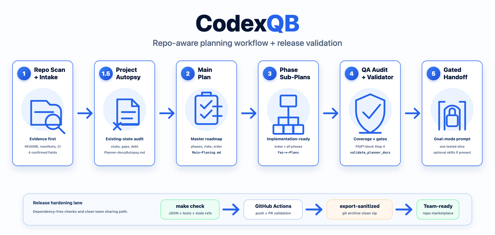

# QB

[](https://github.com/eserlxl/qb/actions/workflows/validate.yml)
[](CHANGELOG.md)
[](LICENSE)

**Repo-aware planning for Codex.** QB turns a project repository into a durable planning package: main plan, existing-project assessment, phase sub-plans, QA audit, and a gated implementation handoff.



QB is a Codex plugin that installs the `$qb` skill. It is built for software, AI, infrastructure, security, and automation projects where planning needs to be evidence-backed, reviewable, and ready for step-by-step execution.

This package is the Codex platform build of QB. The planner prompts, reference docs, and the read-only `validate_planner_docs.py` are host-neutral shared sources maintained once in the QB monorepo and materialized into this plugin by the repository sync step. The plugin manifest, `SKILL.md`, `agents/openai.yaml`, docs, and `scripts/validate.sh` are the Codex-specific host files. QB is an independent project inspired by the original CursorQB/CodexQB planning workflow by Alican Kiraz — not a direct port (MIT).

## Why QB

- **Repo-aware intake:** QB inspects the current repository before asking questions, then proposes evidence-backed defaults for project name, intent, target end state, and constraints.
- **Durable planning docs:** Output is written under `.qb/` so long planning work survives context changes and can be reviewed like normal project documentation.
- **Project Assessment:** Existing projects get a focused `assessment.md` report covering modules, features, placeholders, technical debt, integration gaps, validation gaps, and readiness risks.
- **Full phase decomposition:** The main plan can be expanded into ordered phase folders and detailed sub-plan files, using Assessment feedback when available.
- **QA before implementation:** The audit step checks coverage, naming, ordering, section structure, readiness, security/governance, and implementation preparedness.
- **Gated execution handoff:** QB does not implement product changes itself. It prints a separate Goal mode prompt only when the audit says implementation can begin, then guides that run through the READY queue in small verified slices.

## Workflow

| Step | What QB Does | Output |
| --- | --- | --- |
| 1. Repo Scan + Main Plan | Reads the repository, asks four enriched intake questions, and creates the master plan. | `.qb/main-planning.md` |
| 1.5 Assessment | For existing projects, audits current project structure, features, placeholders, technical debt, integrations, validation, security, and readiness. | `.qb/assessment.md` |
| 2. Phase Sub-Plans | Expands every main phase into detailed implementation-ready sub-plans. | `.qb/sub-planning-index.md`, `.qb/phase-*-plans/*.md` |
| 3. QA Audit | Audits coverage, structure, quality, readiness, and governance without repairing files. | `.qb/sub-planning-audit.md` |
| 4. Gated Handoff | Prints a copy-ready implementation Goal prompt when Step 3 passes. | Text-only Goal mode prompt |

Step 1 runs in the current Codex thread. Steps 2, 3, and 4 are intentionally handed off as text-only Goal mode prompts so the user stays in control of long-running work.

## Quick Start

Add the marketplace from GitHub, then invoke `$qb` in a new Codex thread:

```bash
codex plugin marketplace add eserlxl/qb --ref main
codex plugin add qb@eserlxl
```

If the repository is private, your Codex/GitHub environment must have access to `eserlxl/qb`. To install from a local checkout instead, run the marketplace add from the `platforms/codex` directory:

```bash
cd /absolute/path/to/qb/platforms/codex
codex plugin marketplace add .
codex plugin add qb@eserlxl
```

Start a new Codex thread in the project you want to plan, then ask:

```text
Use $qb to inspect this repo and plan this project.
```

QB will inspect the repository briefly, then ask for:

- `PROJECT_NAME`
- `PROJECT_INTENT`
- `TARGET_END_STATE`
- `KNOWN_CONSTRAINTS`

QB asks intake questions in the user's language when practical. Generated .qb artifacts are English by default unless the user explicitly requests another body language. Required document headings remain English for validator stability.

For existing repositories, the questions include repo-derived suggestions. For empty or minimal repositories, QB falls back to concise generic questions and marks repository evidence as limited.

## Audit and Harden

The same `$qb` skill also launches the audit -> harden -> report engine when you
ask it to audit or harden a repository:

```text
Use $qb. Run the audit and harden engine over this repository.
```

For a direct non-interactive run from the Codex package root, use the bundled
headless entry point:

```bash
python3 plugins/qb/skills/qb/scripts/qb_headless.py --root . --out .qb/audit
```

The default autonomy level is `A0` (report-only). Raise autonomy only by explicit
request; QB never commits, pushes, opens a PR, or deploys on its own.

## Generated Artifacts

QB writes planning artifacts under the target project's `.qb/` directory:

```text
.qb/
  main-planning.md
  assessment.md
  sub-planning-index.md
  sub-planning-audit.md
  phase-0-plans/
    phase-0.1-*.md
  phase-1-plans/
    phase-1.1-*.md
```

The artifact filenames (`main-planning.md`, `sub-planning-index.md`, `sub-planning-audit.md`, `phase-<n>-plans/`, `phase-<n>.<m>-*.md`) are fixed identifiers the bundled planner prompts and validator match exactly — don't rename them.

## Validator

The skill includes a read-only validator:

```bash
python3 plugins/qb/skills/qb/scripts/validate_planner_docs.py --root /path/to/project --mode step2 --strict
python3 plugins/qb/skills/qb/scripts/validate_planner_docs.py --root /path/to/project --mode step3 --strict
python3 plugins/qb/skills/qb/scripts/validate_planner_docs.py --root /path/to/project --mode step4
```

These commands are for manual validation from a QB repository checkout. When running through an installed plugin, QB should use the bundled validator path exposed by the active skill; if that path is unavailable, it should perform equivalent all-file validation and report the fallback clearly.

The validator checks required sections, phase folders, filename conventions, index references, duplicate numbering, unindexed files, length-bounded secret patterns, and Step 4 readiness. P0/P1 audit findings block the implementation handoff.

Maintainers can run the dependency-free package check with:

```bash
make check   # from platforms/codex: validate this package
```

`make check` validates plugin JSON, required package files, `agents/openai.yaml` semantic fields, stale invocation names, and cross-host residue without requiring PyYAML or local Codex validator dependencies.

From the QB monorepo root, `make check` first verifies that shared sources are synced into every platform, then runs all four platform validators and the top-level invariant tests.

## Release Validation

Run this before sharing, committing, or pushing release changes:

```bash
make check   # package-level check when run from platforms/codex
```

The repository also includes GitHub Actions at `.github/workflows/validate.yml`, which runs the same check on pushes to `main` and pull requests.

For sanitized zip sharing, use the tracked-file archive target instead of Finder or generic directory compression:

```bash
make export-sanitized
```

This creates `QB-sanitized.zip` from `git archive`, excluding `.git/`, ignored Python caches, local env files, runtime folders, and other untracked local clutter.

## Safety Model

QB is planning-first. Steps 1-3 should not:

- implement product features;
- refactor source code;
- install dependencies;
- run destructive commands;
- commit, push, deploy, or open pull requests;
- write secrets, tokens, credentials, private keys, or local sensitive environment values into planning files.

Generated plans should distinguish documentation readiness, local readiness, live readiness, production readiness, and operational evidence.

## Repository Layout

Paths in this section are relative to the Codex package root (`platforms/codex/` inside the monorepo, or the repository root for a standalone Codex package).

```text
.agents/plugins/marketplace.json
Makefile
plugins/qb/
  .codex-plugin/plugin.json
  skills/qb/
    SKILL.md
    agents/openai.yaml
    scripts/validate_planner_docs.py
    references/
      first-planner.md
      assessment-planner.md
      second-planner.md
      third-planner.md
      fourth-planner.md
      repo-aware-intake.md
      workflow-quality.md
docs/
  INSTALLATION.md
  MAINTAINING.md
  USAGE.md
  assets/qb-workflow.png
scripts/
  validate.sh
LICENSE
README.md
CHANGELOG.md
```

## Documentation

- [Installation](docs/INSTALLATION.md)
- [Usage](docs/USAGE.md)
- [Maintaining QB](docs/MAINTAINING.md)

## Public Plugin Directory Status

QB currently uses repository marketplace distribution. Public directory or workspace sharing distribution can be revisited separately; this release focuses on repo-marketplace installation and local/team validation.

## Attribution

QB is part of the QB monorepo, an independent project inspired by — not a direct port of — the original CursorQB and CodexQB planning workflow by Alican Kiraz, distributed under the MIT License.

## License

MIT. See [LICENSE](LICENSE).
